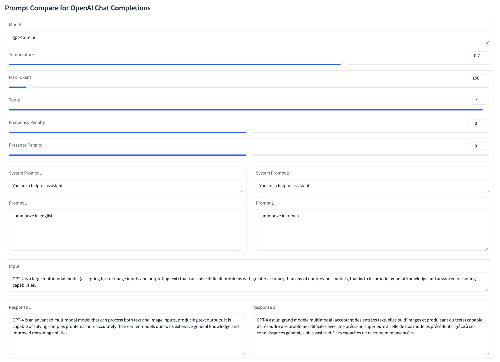

## How to run
1. Install pip packages
2. Have a openai api key in env
3. You can customize a few constant variables. E.g. NUM_PAIRS to 3 you will compare 3 prompts side by side instead of default 2
4. `python prompt-compare.py`

## Screenshot

